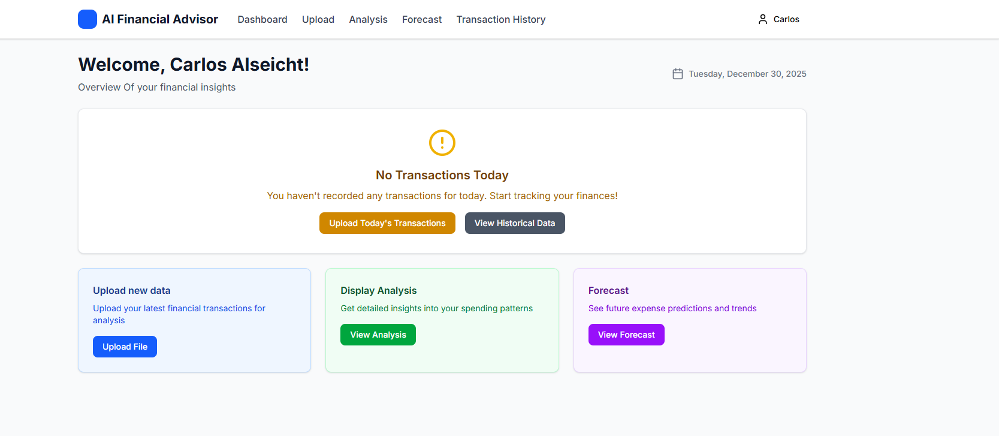
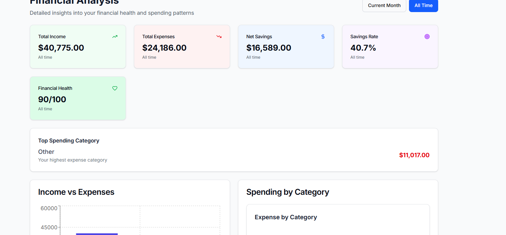
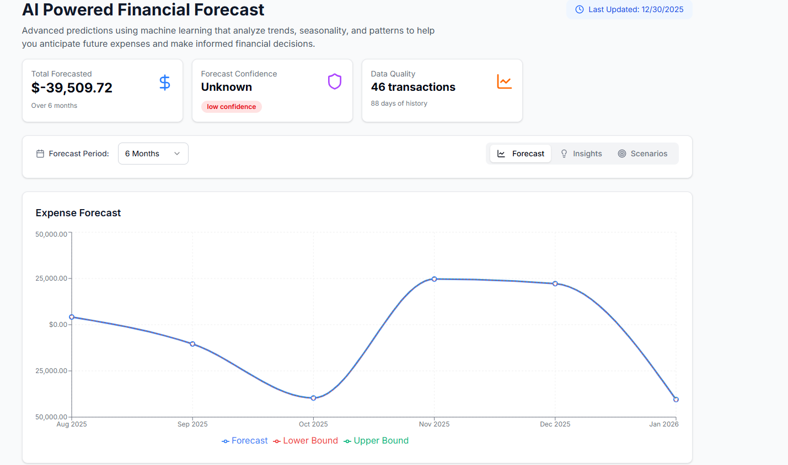

## FINANCIAL ADVISOR AI PRODUCTION GRADE LEVEL Version 2.0 (Still Ongoing)

#
## Getting started to test 

## First

Default: Clone the repository or download the file as .zip

Activate the python virtual environment (Available for Python version 3.3+) in the main directory C:\(your-directory)\Machine Learning Financial Advisor AI and type the python -m venv venv, to create the venv folder and the virtual environment

## Second

Install the required package of modules for both backend (requirements.txt in the backend folder) and frontend to be able to use it

1.for backend just type pip install -r requirements.txt

2.for frontend you can just install all of the dependencies in the package.json by typing npm i (all the dependencies) or npx i (all the dependencies)

## Third

1.create the .env file in the C:\(your-directory)\Machine Learning Financial Advisor AI and fill it in the same way as in the core\config.py file

2.create the .env for frontend folder to use the local backend host server which is http://localhost:8000/api/v1

## Fourth

1.use command uvicorn backend.main:app --reload --host 0.0.0.0 --port 8000 to activate the backend
2.for frontend change the directory to frontend by typing cd frontend and type npm run dev to run it

(make sure you have split the terminal for backend usage and frontend usage)

## Lastly 

have your docker or docker desktop to install redis and qdrant(optional, since this project doesn't have vector database implementend yet) to activate it, since redis is used for second database mainly caching as of now.

## IMAGE PREVIEW

##
## Completed Implementation
### Database and ORM Setup ✅
### User login and creation ✅
### User verification,forgot-password and welcome template ✅
### Implementing JWT authentication and Route protection ✅
### Implementing extraction and chunking for document format .csv and .xlsx ✅
### Implementing API endpoint for upload,analysis,transaction history and AI advice chat ✅
### Implementing Basic frontend ✅
### Implementing financial benchmarking(charts,income,expense,net savings and financial health score) ✅
### Implementing caching and indexing ✅
### Implementing AI advice and fallback secondary LLM model ✅
### Implementing Forecasing and Predictive Analysis ✅
### Implemented Huggingface embedding model ✅
### Implementing documents cloud storage using Supabase ✅
### Implement batch processing for heavy documents load ✅
##
#
## Ongoing Implementation
### Budget tracking and goal system ❌
### Enhance the UI frontend ❌
### Implement Security,Monitoring and Optimization ❌
##
#
**⚠️ PROPRIETARY SOFTWARE - ALL RIGHTS RESERVED**

This repository contains proprietary source code. No license is granted
for any use, modification, or distribution without written permission.

© 2025 Willy Octz
